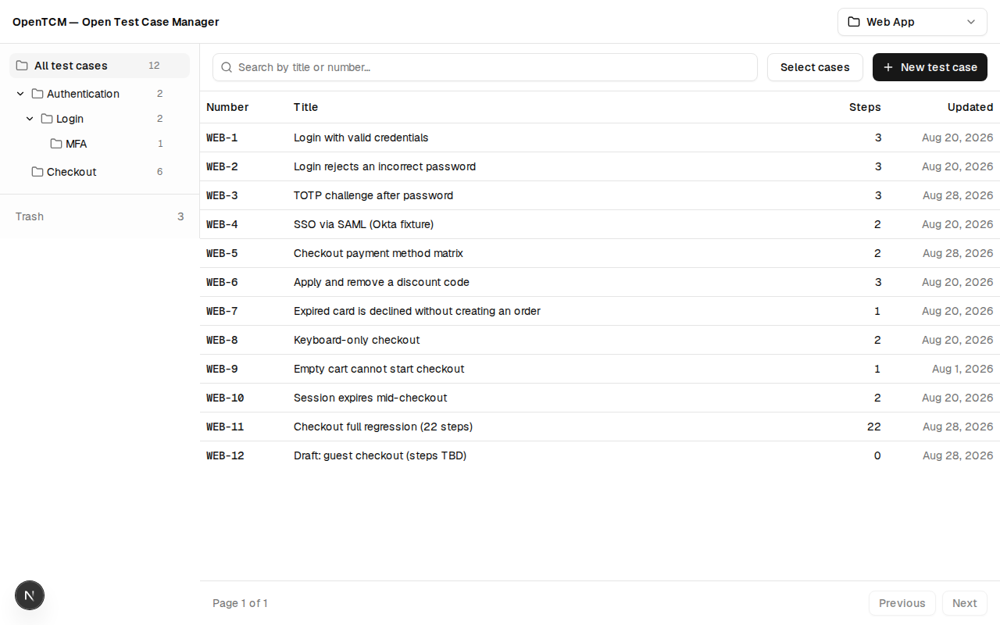
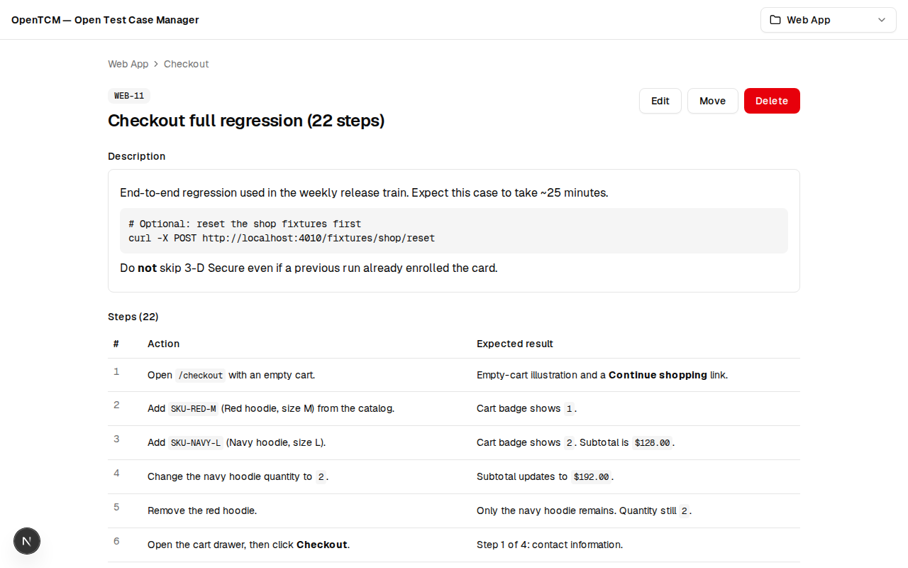
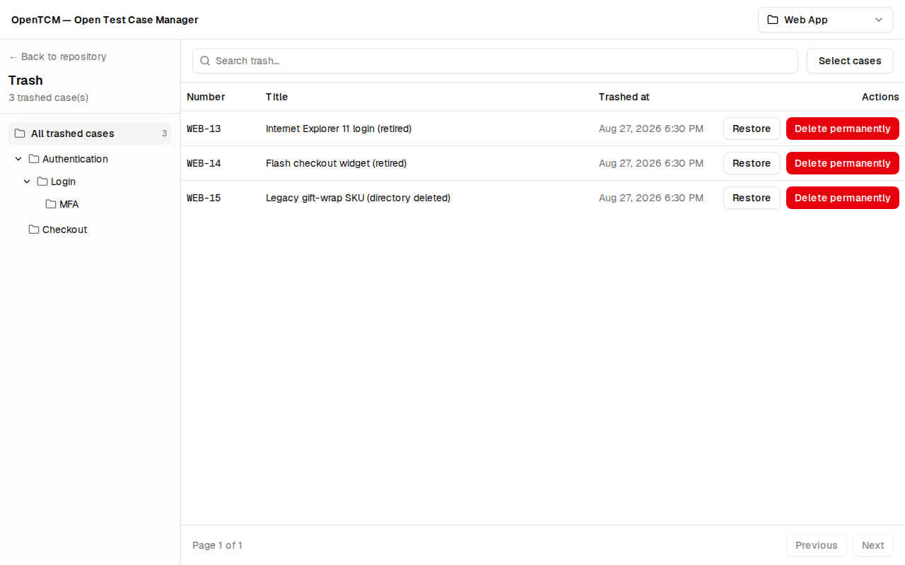

# OpenTCM user guide

Short guide to using **OpenTCM — Open Test Case Manager** v1. For installation see
[`SETUP.md`](SETUP.md).

---

## Projects and prefixes

OpenTCM organizes work into **projects**. Each project has:

- A **name** (e.g. “Web App”).
- A **prefix** (e.g. `WEB`) used in case numbers: `WEB-1`, `WEB-2`, …

Case numbers are assigned automatically when you create a case. They never change,
even if you move a case to another directory or rename the project.

Use the **project switcher** in the header to create a project, switch between
projects, or edit an existing one.

> **Prefix change warning:** Editing a project’s prefix updates how numbers are
> *displayed* (`WEB-5` → `QA-5`) but does not renumber cases. Choose prefixes
> carefully on populated projects.

---

## Directories

Each project has a directory tree in the left sidebar:

- **All test cases** — every active case in the project (this is the default view).
- **Folders** — nested to any depth; click a folder to filter the case list.

Cases with no folder live at the **project root**. That placement is chosen in the
create/move dialogs (the picker labels it “Project root”); it is not a separate
row in the repository sidebar.

Use the **⋯** menu:

- On **All test cases**: **New folder…** only (create a top-level folder).
- On a folder: **New subfolder…**, **Rename…**, **Move…**, or **Delete…**.

When deleting a non-empty folder you choose:

- **Move contents to parent folder** — cases stay active, folder is removed.
- **Move cases to trash** — cases are soft-deleted; the folder is removed.

---

## Writing test cases

Click **New test case** from the repository view.

| Field | Notes |
| --- | --- |
| **Title** | Plain text; shown in lists and at the top of the detail page. |
| **Directory** | Optional; defaults to the folder you were viewing. |
| **Description** | Markdown (headings, lists, tables, code blocks). |
| **Steps** | Ordered list; each step has a required **Action** and optional **Expected result** (both markdown). |

Tips:

- Use the **Preview** tab in markdown fields to check formatting.
- Drag steps or use **Move step N up/down** for keyboard-accessible reordering.
- Leave **Expected result** empty when the outcome is obvious or covered elsewhere.

Open any case from the list to view the full rendered description and steps. Use
**Edit**, **Move**, or **Delete** from the detail page.

---

## Search and pagination

The search box filters by **title** or **case number** (e.g. `WEB-7` or
`valid credentials`). Search applies within the currently selected directory filter.

Pagination controls at the bottom of the list show **Page N of M** with
**Previous** / **Next**. There is no page-size picker in the UI; change page size
via the URL (`?pageSize=25`).

---

## Selection mode and bulk trash

Click **Select cases** in the repository toolbar to enter selection mode:

- Check individual rows, or use the **header checkbox** to select all cases on the
  current page.
- When a search or directory filter is active, **Select all N matching** selects
  every case that matches the filter (not just the current page).
- Click **Move to trash** and confirm the count.

Bulk trash uses the same filter as the list — only matching cases are affected.

---

## Trash, restore, and permanent delete

Deleted cases go to the project **Trash** (link in the sidebar with a count badge).

The trash table shows case number, title, and **Trashed at** timestamp. You can search
and filter trash the same way as the main list.

| Action | Effect |
| --- | --- |
| **Restore** | Returns the case to its original directory, or **project root** if that folder no longer exists. |
| **Delete permanently** | Removes the case forever. The dialog asks you to type **`DELETE`** to confirm. |

**Selection mode** in trash works like the repository: select rows or **Select all N
matching**, then **Restore** or **Delete permanently**. Bulk permanent delete asks
you to type the **count** of cases being deleted **or** the word **`DELETE`**
(the dialog label is `N or DELETE`).

Permanent deletion cannot be undone.

---

## Roles (v1.1)

| Capability | Viewer | Member | Admin |
| --- | --- | --- | --- |
| Read projects, cases, trash, **history** | yes | yes | yes |
| Create / edit / move / trash / restore cases | no | yes | yes |
| **Revert** to a history snapshot | no | yes | yes |
| Directory create / rename / move / delete | no | yes | yes |
| Bulk trash / restore | no | yes | yes |
| Permanent purge | no | no | yes |
| Create / edit projects (prefix) | no | no | yes |
| Users admin | no | no | yes |

The last remaining Admin cannot be deactivated or demoted. Deactivated accounts
cannot sign in until an Admin reactivates them.

The UI hides actions your role cannot use; the API returns **403** if you call a
forbidden endpoint directly.

---

## Case history and revert (v1.1)

Every create, edit, move, trash, restore, and revert appends an event to the case
**History** panel on the detail page (oldest → newest). Each row shows when it
happened, who did it, the action, and a one-line summary. Expand **Snapshot** to
see the full case state after that event.

**Revert** (Member and Admin) restores a chosen snapshot as the new current state
and appends a new event — the timeline is never rewritten.

Example: if a case went **A → B → C** and you revert to the first event (state A),
history becomes **A → B → C → A**. The case body matches A again; events A, B, and
C remain in the list. Viewers see history but not the Revert button.

Seeded WEB/API cases have **no** history until someone mutates them while signed in.

---

## Security model

OpenTCM is designed for **trusted networks**:

- Email + password sign-in with httpOnly session cookies.
- Three instance-wide roles (no per-project ACLs in v1.1).
- Deploy behind a VPN, firewall, or reverse proxy if the instance is not on a
  closed network. See the security note in [`SETUP.md`](SETUP.md).

---

## Further reading

- [`API.md`](API.md) — REST API for automation
- [`DEVELOPMENT.md`](DEVELOPMENT.md) — contributing and local development
